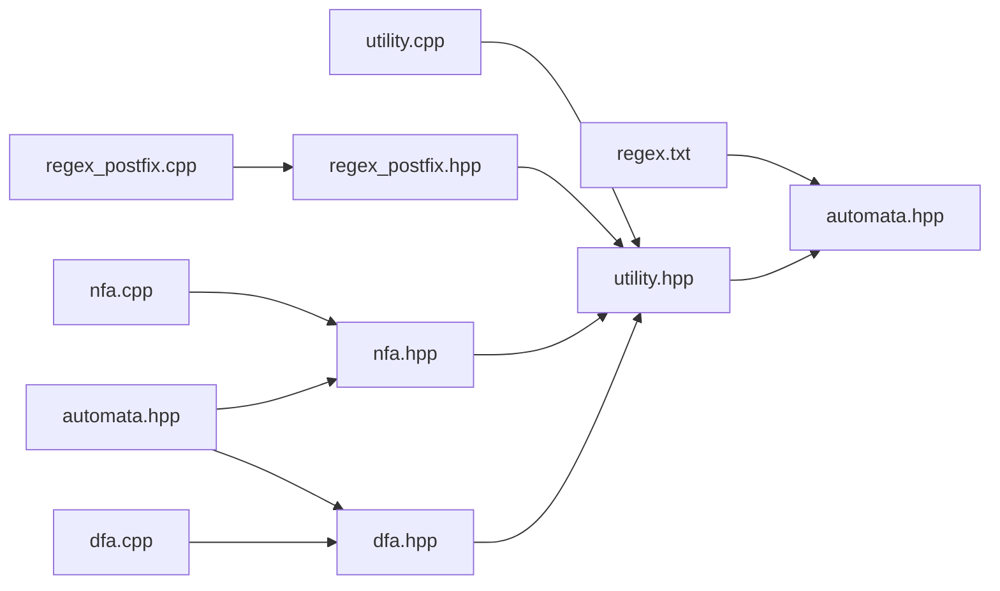
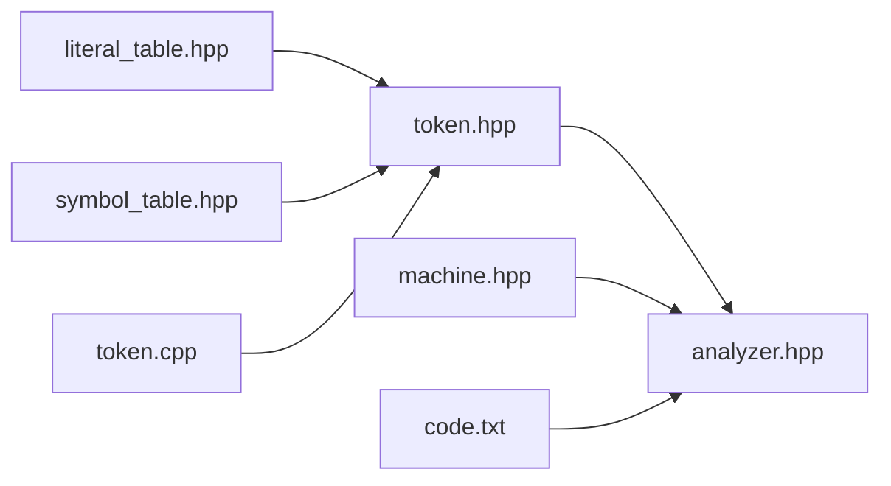
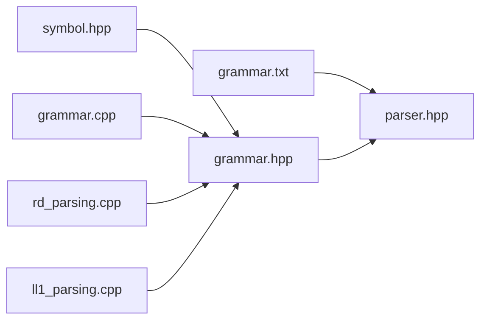

# Compiler
This project attempts to build a compiler based on C++ programming language. There are several stages to this project. 
<ul>
    <li> The first stage involves describing regular expressions for the language. </li>
    <li> The second stage involves building state diagram for each of the regex patterns. We will try to build a DFA for each regex pattern to be used in further stages. </li>
    <li> The third stage will perform lexical analysis of the code. In this part, we will try to generate token sequuences to be used in further stages. </li>
    <li> The fourth stage is defining grammar for our language. </li>
    <li> The fifth stage will perform syntax analysis of the code. We will try to build parser to verify if our token sequence is syntactically correct.
</ul>

## Stage 1
We will define our regex in [regex.txt](sourceFiles/regex.txt) file. 2<sup>nd</sup> stage will use this grammar patterns to build various state machines. It is important that the grammar is defined correctly using **concatenation** `.`, **or** `|`, **Kleen's closure** `*`, **optional** `?` and **Kleen's plus** operator `+`, all at correct places to ensure desired output. To include a wide range of inputs, operators are preceded by `\` as `\.`, `\|`, `\?` or `\*`. Even `(` as operator must be written as `\(` and `)` as `\)`. It will be better if spacing are appropriately added while defining the regular expressions, however, it is not necessary. The structure for grammar statement is : 
```
token_name : expression
Eg: digits : digit \. \( digit \) \*
Eg: digits : digit \+
```

## Stage 2
This stage involves [automata](automata) folder which reads from [regex.txt](sourceFiles/regex.txt) file and for each line, we will build a state machine, particulary a Definite Finite Automata (DFA). 

The folder structure of this stage is shown below : 

| File                           | Description                                                 | 
|--------------------------------|-------------------------------------------------------------| 
| **automata.hpp**               | Defines Automata class                                      | 
| **dfa**                        | Implements DFA logic, including build and minimization      |
| **fsm_elements.hpp**           | Defines core FSM components like `State`, and `Transition`  |
| **fsm.hpp**                    | Entry point for Stage 2 — builds DFAs from grammar.         |
| **nfa**                        | Implements NFA logic, including ε-transitions               |
| **regex_postfix**              | Converts regular expressions to postfix form                |
| **utility**                    | Flows through the overall program across different files    |

The state machines built in this part will be used in next phase to identify various tokens and lexemes. I have explained the working in my other repository [REGEX to Automata](https://github.com/sauravatgithub-web/REGEX-to-Automata). There are little differences but the overall method remains same. Some of them are as follows - 
* This version accepts `string` as input while the directed repo takes `char` as input.
* toPostfix function in regex_postfix.hpp has been changed accordingly fitting to grammar and input rules   described above.
* There is no **print** function in **Automata** class here (it is in the directed repo). Similarly, we are not producing dot files or diagrams in this one.
* For the class **minimized_dfa** in **dfa.hpp**, final_states are now a set for we need them for easy search in later stages.

The work flow diagram in this stage looks as below :- 


## Stage 3
This stage involves [lexical_analysis](lexical_analysis) folder which reads from the [code.txt](sourceFiles/code.txt) file and for each line, we will build token utilizing the state machines developed in previous stage. We will be  performing lexical analysis of the code and create tokens. The token sequences generated will further be used for syntax analysis in next stages.

The folder structure of this stage is shown below : 

| File                           | Description                                                            | 
|--------------------------------|------------------------------------------------------------------------| 
| **analyzer.hpp**               | Entry point for stage 3 - recieves FSMs from stage 2 and builds tokens |
| **literal_table.hpp**          | Defines Literal Table class to store all literals for next stages      |
| **machine.hpp**                | Defines State Machine class for FSMs from Stage 1                      |
| **symbol_table.hpp**           | Defines Symbol Table class to store all identifiers for next stages    |
| **token**                      | Defines token class, token types, keywords and related functions       |

The work in this stage is comparatively easy from the previous stage. To keep it simple, we are parsing through each line of code and simultaneously updating `current_state` of our machines. When we are reaching final state for a machine ensuring that we are the following **maximum substring matching** rule, we build token and store it. While generating the token, if it identifies as identifier, we will store it in symbol table. On the other hand, if it's numerical, floating, string, character or boolean constant, we will store it in literal table. Now, all the tokens generated will be passed to next stage for syntax analysis.

The work flow diagram in this stage looks as below :- 


## Stage 4
We will define our grammar in [grammar.txt](sourceFiles/grammar.txt) file. Our 5<sup>th</sup> stage i.e. syntax analysis will use the grammar built in this stage and the tokens from [Stage 3](#stage-3) to validate our tokens and further building an Abstract Syntax Tree for further analysis.

## Stage 5
This stage involves [syntax_analysis](syntax_analysis) folder where we will take all tokens from the previous stages and match them with our grammar defined earlier. We will read our grammar from the [grammar.txt](sourceFiles/grammar.txt) file to make the grammar. For parsing, we will define different types of parser - **top-down parser** (recursive parser and LL1 parser) and **bottom-up parser**. 

The folder structure of this stage is shown below :

| File                         | Description                                                               | 
|------------------------------|---------------------------------------------------------------------------| 
| **grammar**                  | Defines Grammar class and related functions                               |
| **parser.hpp**               | Entry file for stage 5 - recieves tokens and parse them                   |
| **ll1_parsing.cpp**          | Utilizes LL(1) parsing technique to parse the tokens                      |
| **rd_parsing.cpp**           | Utilizes recursive top-down parsing technique to parse through the tokens |
| **symbol.hpp**               | Defines Symbol class                                                      |

The work in this stage is described for all kinds of parser as below :
- **Recursive Descent Parser**<br/>
The basic idea of this kind of parser is recursively go through the grammar while iterating through the tokens and matching token_type and symbol. If a certain production fails, we will check the next production, if available. Removal of left recursion and left factoring is essential, otherwise, recursion may never stop.
  - `recursive_descent_procedure` function collects all possible endings for the start symbol and check if any ending equals to string length to confirm correct parsing. 
  - `recursive_descent_main_procedure` and `recursive_descent_procedure` assist in recursion steps for this parser. 
  - Say, A -> BC is a production, then recursively we will find all possible endings from B. Then all those endings will serve as starting point for C. This way, we will calculate for all productions from the start symbol.
- **LL(1) Parser**<br/>
This kind of parser utilizes FIRST and FOLLOW of non-terminal symbols to generate parse table. Parse table simplifies the task of selecting production by assigning one production to each unique set of non terminal and terminal symbol. Now, it's important to understand that not all kinds of grammar can be parsed by this method because left recursion can be a problem. Removal of left recursion and left factoring is essential. Further, input token, parse table and stack is used to parse and produce output. The parsing fails if, for a given non-terminal and terminal symbol, no production exists or not all tokens are parsed.
  - `makeFirsts` and `makeFollow` function are used to build FIRST and FOLLOW for each non terminal.
  - `create_parse_table` function builds up the parse table.
  - `LL1_Parser` function is the main parser function which utilizes stack to verify tokens.

The work flow diagram in this stage looks as below :- 
